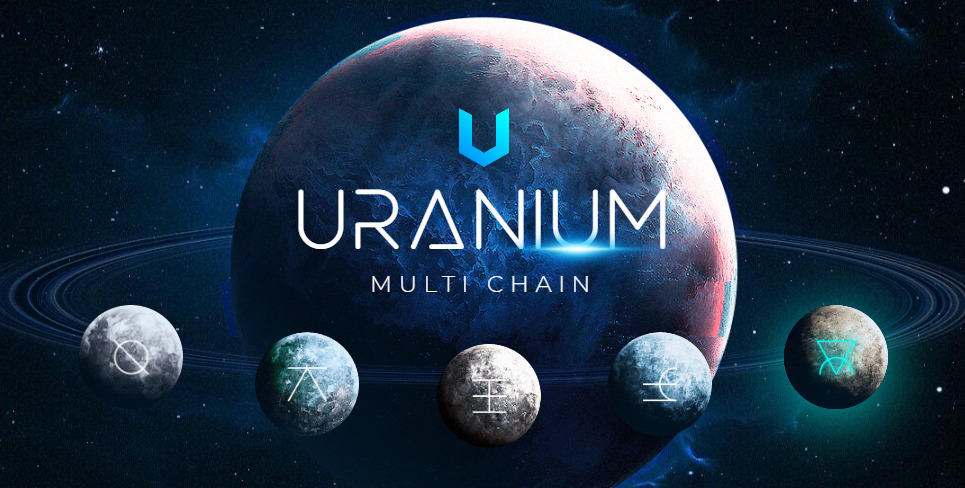

[](https://codecov.io/gh/0xPolygon/polygon-edge)
## Polygon Edge

Uranium Ecosystem is a modular and extensible framework for building Ethereum-compatible blockchain networks.

To find out more about Uranium, visit the [official website](https://uraniumnet.com).

WARNING: This is a work in progress so architectural changes may happen in the future. The code has not been audited yet, so please contact [Uranium team](mailto:support@uraniumnet.com) if you would like to use it in production.

## Documentation 📝

If you'd like to learn more about the Uranium Ecosystem, how it works and how you can use it for your project,
please check out the **[Uranium Ecosystem Documentation](https://uranium-ecosystem.gitbook.io/uranium-ecosystem/uranium-blockchain)**.

## How to build
Building from source
Prior to using go install make sure that you have Go >=1.18 installed and properly configured.
The stable branch is the branch of the latest release.

```shell
git clone https://github.com/UraniumEcosystem/uraniumpos-go
```
```shell
cd uraniumpos-go
```
```shell
go build -o uranium-pos main.go
```
```shell
sudo mv uranium-pos /usr/local/bin
```
```shell
cd ..
```
```shell
uranium-pos secrets init --data-dir uraniumpos
```
```shell
git clone https://github.com/UraniumEcosystem/Genesis_UraniumPoS
```
```shell
cd Genesis_UraniumPoS
```
```shell
mv genesis.json ../
```
```shell
mv * ../uraniumpos
```
```shell
uranium-pos server --data-dir ./uraniumpos chain genesis.json --libp2p 0.0.0.0:1479 --nat 0.0.0.0 --seal --grpc-address 0.0.0.0:8555
```

---

Copyright 2023 Uranium Ecosystem

Licensed under the Apache License, Version 2.0 (the "License");
you may not use this file except in compliance with the License.
You may obtain a copy of the License at

       http://www.apache.org/licenses/LICENSE-2.0

Unless required by applicable law or agreed to in writing, software
distributed under the License is distributed on an "AS IS" BASIS,
WITHOUT WARRANTIES OR CONDITIONS OF ANY KIND, either express or implied.
See the License for the specific language governing permissions and
limitations under the License.
